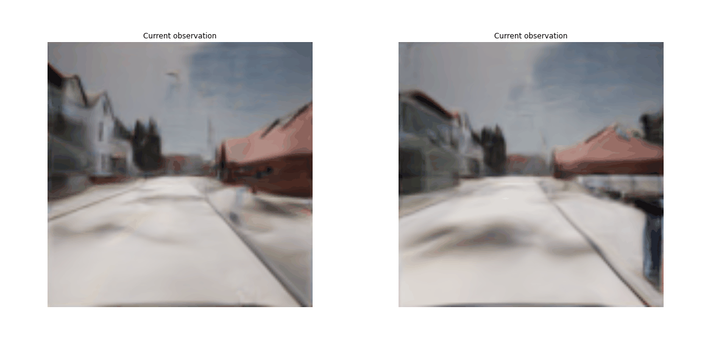

# 3D Scene Reconstruction with Neural Radiance Fields: Exploring Generative Scene Networks (GSN) with Outdoor Scenes
**Extended from Unconstrained Scene Generation with Locally Conditioned Radiance Fields (ICCV 2021)**<br>

### [Project Page](https://github.com/tjtanaa/ml-gsn.git) | [Outdoor Data](#outdoor-datasets) | [PPTX](https://docs.google.com/presentation/d/1by6fcgvDywuShHKxPknzwhYIWuPiIy1Q12wI4AK31G4/edit?usp=sharing) | [Original Project Page](https://apple.github.io/ml-gsn/) 

## Abstract
The recent success of Neural Radiance Field has drawn
much attention in the field. While most of the works are on
object rendering, only a few works are on large scene rendering. Since some of our group mates work on autonomous
driving, we thought it would be interesting if we could develop an implicit-based cityscape navigation project similar
to the GoogleMap’s road map navigation. We found an indoor scene rendering work particularly suitable as a starting
point of our project. Based on this work, we worked on two
dimensions to explore our idea on the work. Specifically, we
tested on a few model architectures on its original dataset
and, explored the model performance with different KITTI-like datasets. Our results shows the possibility of performing
implicit rendering for outdoor complex cityscape, which can
be referenced for further development.


## Requirements
This code was tested with Python 3.6 and CUDA 11.1.1, and uses Pytorch Lightning. A suitable conda environment named `gsn` can be created and activated with:
```
conda env create -f environment.yaml python=3.6
conda activate gsn
```
If you do not already have CUDA installed, you can do so with:
```
wget https://developer.download.nvidia.com/compute/cuda/11.1.1/local_installers/cuda_11.1.1_455.32.00_linux.run
sh cuda_11.1.1_455.32.00_linux.run --toolkit --silent --override
rm cuda_11.1.1_455.32.00_linux.run
```
Custom CUDA kernels may not work with older versions of CUDA. This code will revert to a native PyTorch implementation if the CUDA version is incompatible, although runtime may be ~25% slower.

__(Note: If you found any problem with the setup please refer to the [original repository](https://apple.github.io/ml-gsn/) for more details)__

## Outdoor Datasets
We have trained the model on 4 different datasets. Namely,
1. [KITTI-360 Dataset](http://www.cvlibs.net/datasets/kitti-360/)
2. [KITTI Odometry Dataset](http://www.cvlibs.net/datasets/kitti/eval_odometry.php)
3. [KITTI-Carla Dataset](https://npm3d.fr/kitti-carla)
4. [Carla Dataset](https://carla.org/)

The dataset has been preprocessed by us and the way to setup the dataset please refer to the links below.
1. [KITTI-360 Dataset](doc/kitti360.md)
2. [KITTI Odometry Dataset](doc/kitti_odometry.md)
3. [KITTI-Carla Dataset](doc/kitti_carla.md)
4. [Carla Dataset](doc/carla.md)


## Getting Started
Please refer to the following links to learn how to setup the repository and model for each dataset.
Similar to the original repository. We have provided OneDrive links to the preprocessed data for
training and also a single `log` directory as pretrained model for qualitative evaluation which is
done through `notebooks/walkthrough_demo.ipynb`/`notebooks/walkthrough_demo_odokitti.ipynb`
1. [KITTI-360 Dataset](doc/kitti360.md)
2. [KITTI Odometry Dataset](doc/kitti_odometry.md)
3. [KITTI-Carla Dataset](doc/kitti_carla.md)
4. [Carla Dataset](doc/carla.md)

## Qualitative Results of KITTI-CARLA and CARLA 

__Caption__: KITTI-CARLA Random View (Left: Model trained with single view image sequence; Right: Model trained with stereo-view image sequence)
The GIF of original sequence can be found in the `pptx` slide 13.


__Caption__: KITTI-CARLA Random View (Left: Model trained with single view image sequence; Right: Model trained with stereo-view image sequence)
The GIF of original sequence can be found in the `pptx` slide 16.