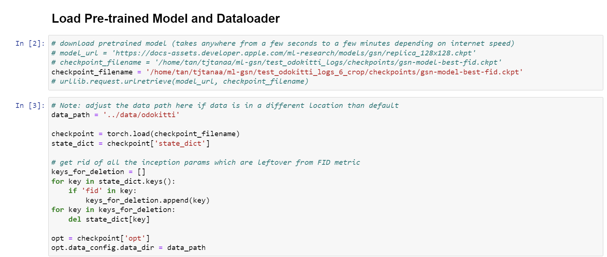

# PREPARING KITTI-360 DATASET

## Links to original dataset.
- [KITTI-360 Dataset](http://www.cvlibs.net/datasets/kitti-360/)
- [Preprocessing tools and Processed Kitti-360 Dataset](https://hkustconnect-my.sharepoint.com/:f:/g/personal/hpaat_connect_ust_hk/Eor7lz08LsdOr-lvweXiJZMBEV6wYf1ZlBmuJX7J0XrmdA?e=rBFpRe)


## Preprocessing new sequences from raw dataset.
1. After extracting the zip files downloaded from the KITTI-360 Dataset, it should have the following file structure.
```
<data_path>
└── kitti-360_preprocessing
    ├── kitti360_for_mlgsn.ipynb
    ├── tools
    │   └── tools.py
    ├── calibration
    │   └── perspective.txt
    │   └── ...
    ├── data_poses_2
    │   ├── 2013_05_28_drive_0000_sync
    │   │   └── cam0_to_world.txt
    │   │   └── poses.txt
    │   └── ...
    ├─── KITTI-360
    │    ├── data_2d_raw
    │    │   ├── 2013_05_28_drive_0000_sync
    │    │   │   ├── image_00 
    │    │   │   │   ├── data_rect 
    │    │   │   │   │   └── 0000000000.png
    │    │   │   │   │   └── ...
    │    │   │   │   └── timestamps.txt
    │    │   │   └── image 01   
    │    │   │       ├── data_rect 
    │    │   │       │   └── 0000000000.png
    │    │   │       │   └── ...
    │    │   │       └── timestamps.txt
    │    │   └── ...
    │    └── data_3d_raw
    │        ├── 2013_05_28_drive_0000_sync
    │        │   └── velodyne points 
    │        │       ├── data
    │        │       │   └── 0000000000.bin
    │        │       │   └── ...
    │        │       └── timestamps.txt
    │        └── ...
    └── kitti360_for_mlgsn (empty folder)
```


2. Remove any contents in the `kitti360_for_mlgsn` folder. Run `ml-gsn/data/kitti-360_preprocessing/kitti360_for_mlgsn.ipynb` to generate training data.


3. The script will generate output with the following file structure compatible with the ml-gsn model.
```
kitti360_for_mlgsn
└── train
    └── 00
        └── 000_depth.tiff
        └── 000_rgb.png
        └── camera.json
        └── ...
```

4. Copy `train` folder and paste it inside `ml-gsn/data/kitti360`


## Setup data with the processed dataset.
1. Extract the zip files at the `ml-gsn/data` into a directory named `kitti360`.
```
ml-gsn
├── data
    └── kitti360
        └── train
            └── 00
                └── 000_depth.tiff
                └── 000_rgb.png
                └── ...
```


## Training Model
1. Edit the GPUs devices, config files, log_path in `scripts/launch_gsn_kitti360_64x64.sh`.
2. Run `bash scripts/launch_gsn_kitti360_64x64.sh`.

## Testing Pretrained Model (Qualitative Evaluation)
1.  Download the [_`log_dir`_](https://hkustconnect-my.sharepoint.com/:f:/g/personal/hpaat_connect_ust_hk/Eor7lz08LsdOr-lvweXiJZMBEV6wYf1ZlBmuJX7J0XrmdA?e=rBFpRe) to the root of project. 
1.	Put the corresponding preprocessed dataset downloaded from the drive to the `data/` folder.
2.	Start Jupyter server. 
3.	Open `notebooks/walkthrough_demo.ipynb`.
4.	Change the absolute path inside to your corresponding absolute path. (`checkpoint_filename` and `data_path`)

5.	Run it.

## Model Training and Testing Information:
1.	Stored in logs.
2.	`test_logs_<log_postfix>` give the visualization of the model training details.
