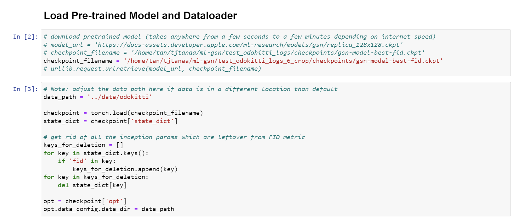

# PREPARING KITTI ODOMETRY DATASET

## Links to original dataset.
- [KITTI Odometry Dataset](http://www.cvlibs.net/datasets/kitti/eval_odometry.php)
- [Processed Kitti Dataset](https://hkustconnect-my.sharepoint.com/:f:/g/personal/tjtanaa_connect_ust_hk/EifqSVB0diNDlVcqTCE9DUwBTlYaqD3gysk7AcGzn9-GhQ?e=DO6Sr1)


## Preprocessing new sequences from raw dataset.
1. After extracting the zip files downloaded from the KITTI Odometry Dataset, it should have the following file structure.
```
<dataset_path>
├── poses
│   └── 00.txt
└── sequences
    └── 00
        ├── calib.txt
        ├── times.txt
        ├── image_2
        ├── image_3
        └── velodyne
```

2. Edit the `ml-gsn/datasets/convert_kitti_to_mlgsn_format.py`. Remove any contents in the `<absolute_path_to_output_folder>`.
```
...
def get_union_sets(conditions):
    output = conditions[0]
    for i in np.arange(1, len(conditions)):
        output = np.logical_and(output, conditions[i])
    return output


BASEDIR = <absolute_path_to_the_dataset_directory>

RANGE_X = [0., 70.4]
RANGE_Y = [-40., 40.]
RANGE_Z = [-3., 1.]

...


sequences = ['05'] # Change the sequence of interest, it could be a list of sequences

converter = OdometryKittiMlgsnConverter(BASEDIR, sequences, frame_step=100, train_test_split=[1.0, 0.0])

converter.start_process(<absolute_path_to_output_folder>)


```

3. The script will generate output with the following file structure compatible with the ml-gsn model.
```
<output_folder_path>
├── train
│   └── 00
│       └── 000_depth.tiff
│       └── 000_rgb.png
│       └── ...
└── test
    └── 00
        ├── 000_depth.tiff
        ├── 000_rgb.png
        └── ...
```

4. Create a softlink at the `ml-gsn/data` directory with link name `odokitti`. Command: `ln -s <absolute_path_to_output_folder> ./odokitti`.


## Setup data with the processed dataset.
1. Extract the zip files at the `ml-gsn/data` into a directory named `odokitti`.
```
ml-gsn
├── data
    └── odokitti
        ├── train
        │   └── 00
        │       └── 000_depth.tiff
        │       └── 000_rgb.png
        │       └── ...
        └── test
            └── 00
                ├── 000_depth.tiff
                ├── 000_rgb.png
                └── ...
```


## Training Model
1. Edit the GPUs devices, config files, log_path in `scripts/launch_gsn_odokitti_64x64.sh`.
2. Run `bash scripts/launch_gsn_odokitti_64x64.sh`.


## Testing Pretrained Model (Qualitative Evaluation)
1.  Download the [_`log_dir`_](https://hkustconnect-my.sharepoint.com/:f:/g/personal/tjtanaa_connect_ust_hk/EifqSVB0diNDlVcqTCE9DUwBTlYaqD3gysk7AcGzn9-GhQ?e=DO6Sr1) to the root of project. 
2.	Put the corresponding preprocessed dataset downloaded from the drive to the `data/` folder.
3.	Start Jupyter server. 
4.	Open `notebooks/walkthrough_demo_odokitti.ipynb`.
5.	Change the absolute path inside to your corresponding absolute path. (`checkpoint_filename` and `data_path`)

6.	Run it.

## Model Training and Testing Information:
1.	Stored in logs.
2.	`test_logs_<log_postfix>` give the visualization of the model training details.
